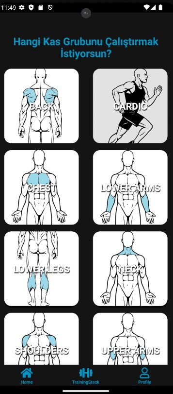
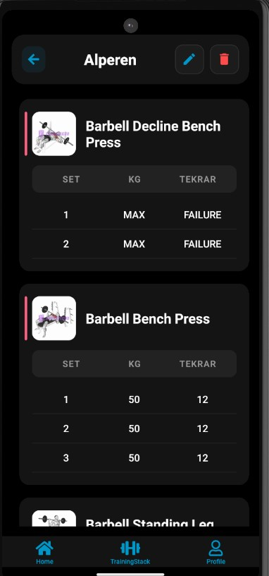
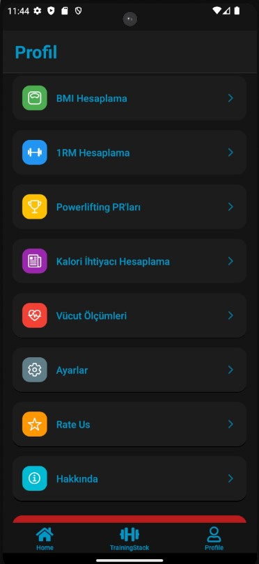
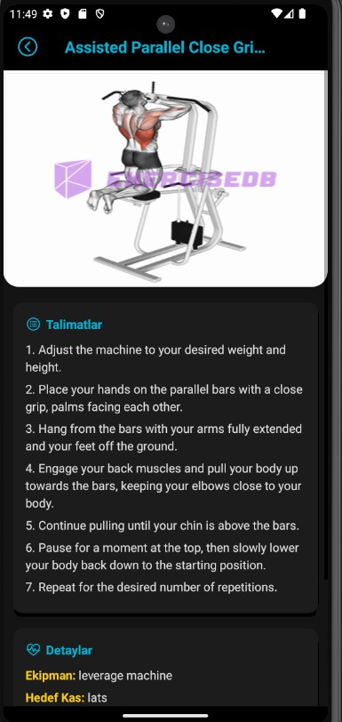

<<<<<<< HEAD
# 🏋️ Hypertro - Fitness Workout Tracker App

**Hypertro** is a modern fitness tracking application built with React Native and Firebase.  
It helps users build, manage, and track their workout routines using features like supersets, dropsets, categorized folders, and real-time performance input.

---

## 🎥 Demo Video

Watch the full demo on YouTube:  
👉 [Hypertro - Fitness App Demo](https://www.youtube.com/watch?v=6wpUIr66KNA)

---

## 📸 Screenshots

| Muscle Group Selection | Exercise List | Workout Builder |
|------------------------|---------------|-----------------|
|  |  |  |

| Workout Detail | Folder System | Workout Overview |
|----------------|---------------|------------------|
|  |  |  |

| Profile Page | Info Page | Login / Register |
|-------------|-----------|------------------|
|  |  |   |

---

## 🔥 Features

- Select exercises by muscle group using body map SVGs
- Create workouts with support for **supersets**, **dropsets**, and multiple sets
- Organize workouts into custom folders
- Save workout data locally (or in Firestore)
- Use tools like:
  - BMI calculator
  - 1RM calculator
  - Calorie needs estimator
  - Body measurement tracker
- Secure login with email & Google (Firebase Auth)
- Responsive and dark-themed UI built with Expo

---

## ⚙️ Tech Stack

- ⚛️ **React Native (TypeScript)**
- 🔥 **Firebase (Auth + Firestore)**
- 📦 **Expo**
- 💾 **AsyncStorage**
- 🎨 **Custom SVG rendering for muscle groups**

---

## 🚀 Installation

```bash
git clone https://github.com/YOUR-USERNAME/Hypertro.git
cd Hypertro
npm install
npx expo start
=======

>>>>>>> 07da432cb69b00ebe3d1858914a496b44942c161
