# 🏋️ Hypertro - Fitness Workout Tracker App

**Hypertro** is a modern fitness tracking application built with React Native and Firebase.  
It helps users build, manage, and track their workout routines using features like supersets, dropsets, categorized folders, and performance tools like BMI and 1RM calculators.

---

## 🎥 Demo Video

Watch the full demo on YouTube:  
👉 [Hypertro - Fitness App Demo](https://www.youtube.com/watch?v=6wpUIr66KNA)

---

## 📸 Screenshots

<table>
  <tr>
    <td align="center"><strong>Login</strong><br>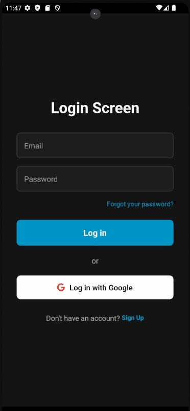</td>
    <td align="center"><strong>Register</strong><br>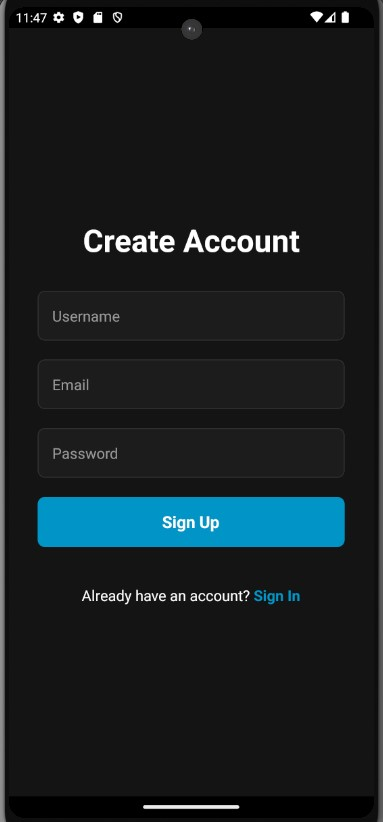</td>
    <td align="center"><strong>Profile</strong><br>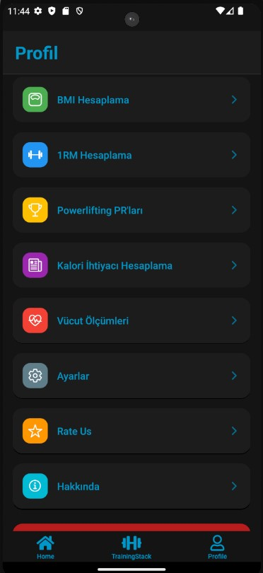</td>
  </tr>
  <tr>
    <td align="center"><strong>Muscle Group Selection</strong><br>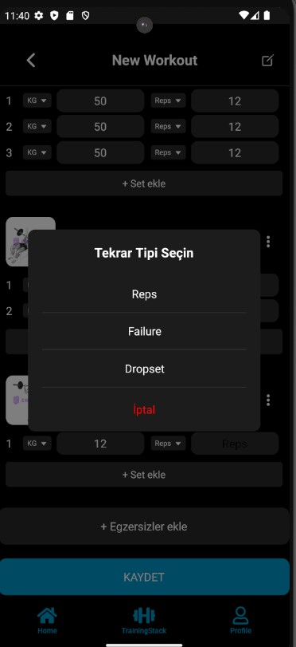</td>
    <td align="center"><strong>Workout Builder</strong><br>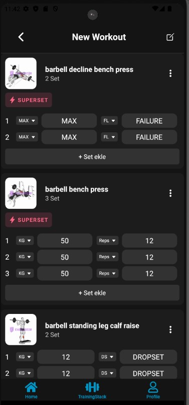</td>
    <td align="center"><strong>Exercise List</strong><br>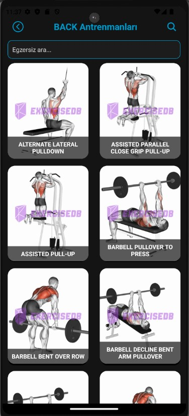</td>
  </tr>
  <tr>
    <td align="center"><strong>Workout Detail</strong><br>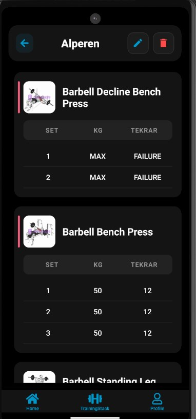</td>
    <td align="center"><strong>Workout Overview</strong><br>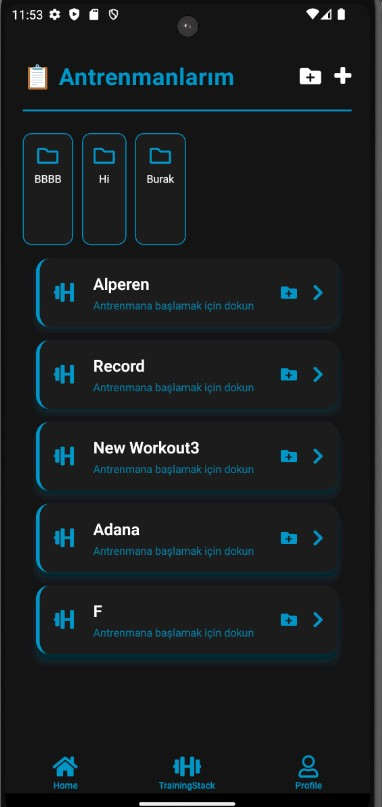</td>
    <td align="center"><strong>Folders</strong><br>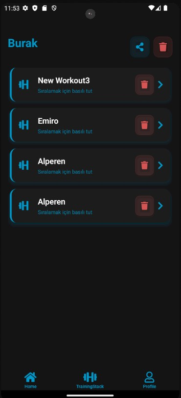</td>
  </tr>
  <tr>
    <td align="center"><strong>Info Page</strong><br>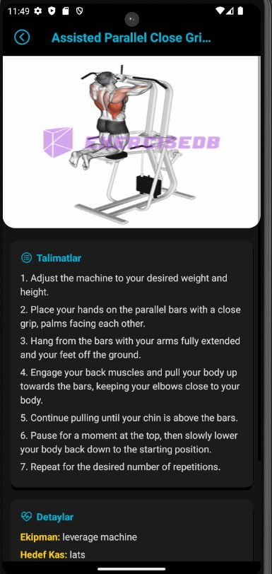</td>
    <td align="center"><strong>BMI Calculator</strong><br>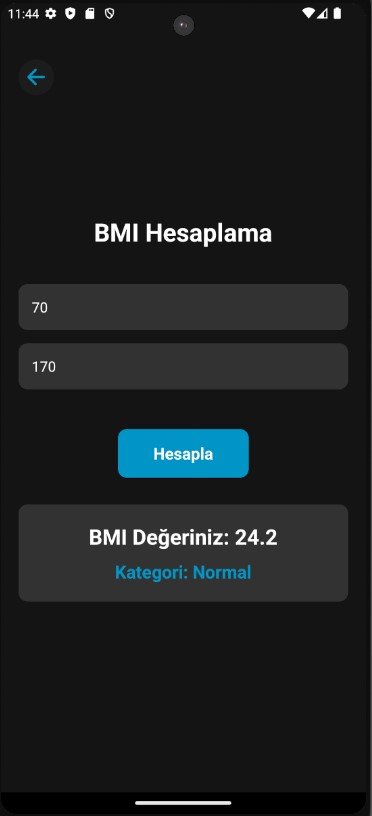</td>
    <td align="center"><strong>Size Input</strong><br>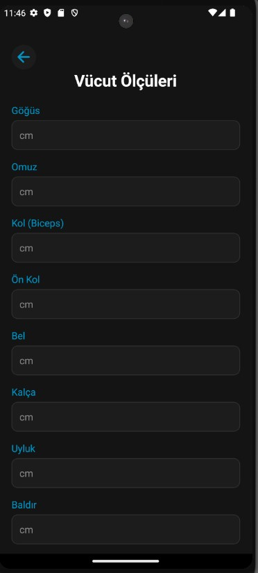</td>
  </tr>
</table>

---

## 🔥 Features

- 🧠 Select exercises by muscle group with body map SVGs
- 🏋️ Create workouts with support for **supersets**, **dropsets**, and custom sets
- 📂 Organize workouts into folders
- 📈 Save workout data locally (AsyncStorage) or via Firebase
- 🧮 Tools included:
  - BMI Calculator
  - One-Rep Max (1RM)
  - Calorie Needs Estimator
  - Size Tracker (Body Measurements)
- 🔐 Firebase Auth (Email & Google Sign-In)
- 🌗 Responsive and Dark-themed UI (Expo + TypeScript)

---

## ⚙️ Tech Stack

- ⚛️ **React Native (TypeScript)**
- 🔥 **Firebase (Auth & Firestore)**
- 📦 **Expo**
- 💾 **AsyncStorage**
- 🎨 **SVG support for interactive visuals**

---

## 🚀 Installation

```bash
git clone https://github.com/YOUR-USERNAME/Hypertro.git
cd Hypertro
npm install
npx expo start
